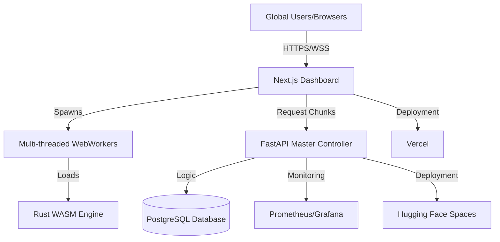

# Project Sisyphus: Distributed Brute-Force Compute Grid


Project Sisyphus is a high-performance, web-based distributed compute grid designed for cryptographic key recovery. It leverages the idle CPU power of browsers worldwide using multi-threaded WebAssembly (Rust) to perform massive-scale brute-force searches for specific blockchain addresses.

---

## 👁️ Vision
In the early days of blockchain, billions of dollars in assets were lost to "ghost" addresses—wallets where the private keys were lost, typed incorrectly, or forgotten. Sisyphus democratizes the "Digital Archaeology" of these lost assets. By distributing small chunks of the search space to thousands of participants via a simple web link, we transform a mathematically impossible task into a collective "Rescue Mission."

---

## 🏗️ Architecture

Sisyphus uses a modern, high-concurrency architecture to manage global workloads:



### Key Components:
- **Master Controller (Backend):** FastAPI server orchestrating "Chunk" distribution and aggregate leaderboard stats.
- **WASM Miner (Engine):** High-performance Rust library compiled to WebAssembly for `secp256k1` address derivation.
- **Grid Dashboard (Frontend):** Next.js application that manages WebWorkers and provides real-time visualization of the search.
- **Command & Control:** An integrated admin panel to re-target the entire global grid to a new address in one click.

---

## 🚀 Running Locally

### Prerequisites:
- Python 3.9+
- Node.js 18+
- Rust & `wasm-pack`

### 1. Backend Setup
```bash
cd backend
pip install -r requirements.txt
# Set DATABASE_URL and JWT_SECRET in .env
python main.py
```

### 2. Rust WASM Build
```bash
cd frontend/wasm-miner
wasm-pack build --target web
```

### 3. Frontend Setup
```bash
cd frontend
npm install
npm run dev
```

---

## 🛠️ Workflows

### The "Sisyphus Cycle":
1. **Targeting:** Admin sets a "Global Target Address" via the Command Center.
2. **Dispatching:** Backend generates a "Chunk" (a range of private keys) and hands it to a connected worker.
3. **Crunching:** The worker uses 10+ CPU threads to test every key in the chunk via Rust WASM.
4. **Validation:** If a match is found, the worker halts and submits the private key to the backend.
5. **Leaderboard:** Contributions are tracked in real-time to gamify the recovery process.

---

## 🔮 Future Vision (Roadmap)

- [ ] **WebGPU Acceleration:** Offloading `secp256k1` multiplication to the GPU for a 10x-50x performance boost.
- [ ] **Mobile Optimization:** Specialized PWA support for background mining on Android/iOS.
- [ ] **Multi-Chain Support:** Expanding search logic to Bitcoin (SegWit), Solana (Ed25519), and Dogecoin.
- [ ] **Automatic Hunter:** An AI agent that automatically identifies "Stale Whale" addresses with high balances and zero movement to prioritize them.

---

## 📜 License
This project is licensed under the MIT License. Use responsibly for educational and recovery purposes.
